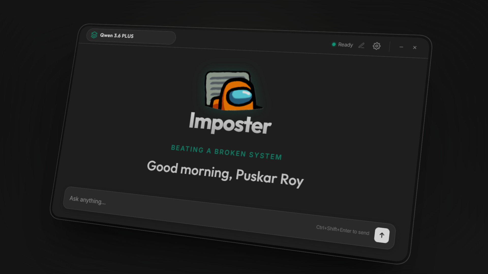

# Imposter: Discrete AI Assistant

<div align="center">
  
  <h3>A seamless, unobtrusive AI interface for your desktop environment.</h3>
  <p><i>The AI Phantom That Doesn't Exist—Until You Need It.</i></p>
  <br>
  
</div>

---

## Technical Overview

**Imposter** is a background-first AI assistant application designed for maximum discretion. Built on a specialized multi-process architecture, it remains hidden, non-intrusive, and computationally isolated from primary workflows until explicitly triggered via a **Systematic Override**.

### Core Pillars

1. **Absolute Stealth**: Invisible to Zoom, Teams, OBS, and standard screen-sharing protocols through OS-level content protection.
2. **Local Sovereignty**: All application data, including API keys, system prompts, and conversation history, is stored 100% locally on the device.
3. **Multi-turn Intelligence**: Powered by a robust persona engine with resume injection and job targeting capabilities.
4. **Hardware Integrations**: Real-time system audio transcription via AssemblyAI and local OCR via Tesseract.js.

---

## System Capabilities

| Category | Highlights |
|---|---|
| **Interface** | Frameless • Transparent • Always-on-top • Screen-Shield (DRM Protected) |
| **Intelligent Engine** | Multi-turn memory • Custom Instruction Context • Markdown + Syntax Highlighting |
| **Multi-Provider** | Local models via **Ollama** • Cloud models via **OpenRouter** |
| **Audio Processing** | Live system audio capture • AssemblyAI transcription • Dynamic Island overlay |
| **Screen Capture & OCR** | Full-screen coordinate crop • Local Tesseract.js extraction • Auto-fill prompt |

> [!NOTE]
> **Comprehensive Documentation Available**  
> *   For a full inventory of the persona engine and config panels, see the **[Feature Map](docs/features.md)**.
> *   For technical details on IPC, AudioWorklets, and Stealth mechanics, see the **[Architecture Guide](docs/architecture-guide.md)**.

---

## Global Shortcuts

Control the assistant seamlessly from any application using hardcoded system-level shortcuts:

| Shortcut | System Action |
| :--- | :--- |
| `Ctrl + Shift + I` | **Focus Input**: Shift system focus directly to the prompt input. |
| `Ctrl + Shift + Enter` | **Execute Query**: Trigger the AI process from any context. |
| `Ctrl + Shift + S` | **Screen Snip**: Launch the OCR-enabled region selection tool. |
| `Ctrl + Shift + B` | **Toggle Voice**: Start/stop system audio transcription & Dynamic Island. |
| `Ctrl + Shift + C` | **Deep Copy**: Copy the raw AI response directly to the system clipboard. |
| `Ctrl + Shift + Q` | **Terminate**: Force close the application instantly. |

---

## Local Development (Website)

This repository contains the landing page and documentation hub for the Imposter project.

1. **Install Dependencies**:
   ```bash
   pnpm install
   ```
2. **Launch Development Server**:
   ```bash
   pnpm dev
   ```
3. **Build for Production**:
   ```bash
   pnpm build
   ```

---

## Disclaimer

This application is provided strictly for **educational, developmental, and personal productivity purposes**. The author assumes no responsibility for any misuse or compliance violations associated with the deployment of this software.

Developed by **Puskar Roy**.

© 2026 Imposter AI. All rights reserved.
